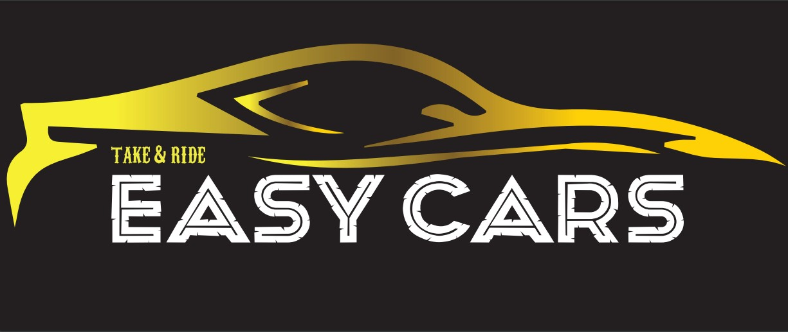
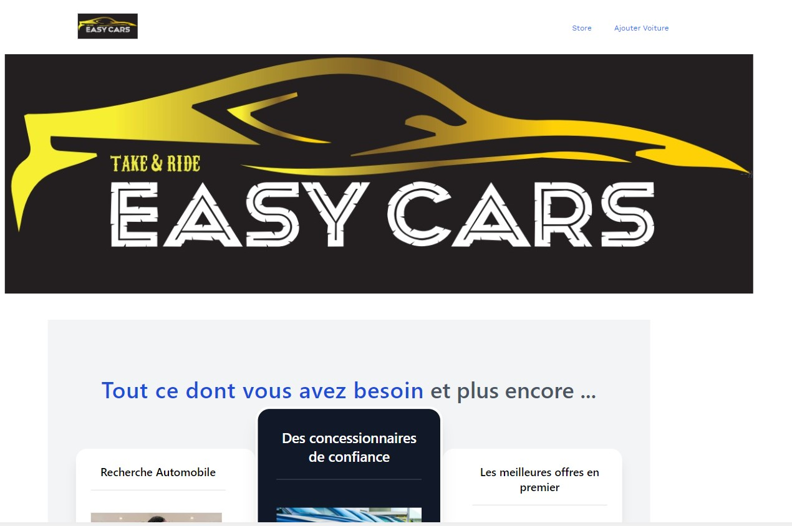
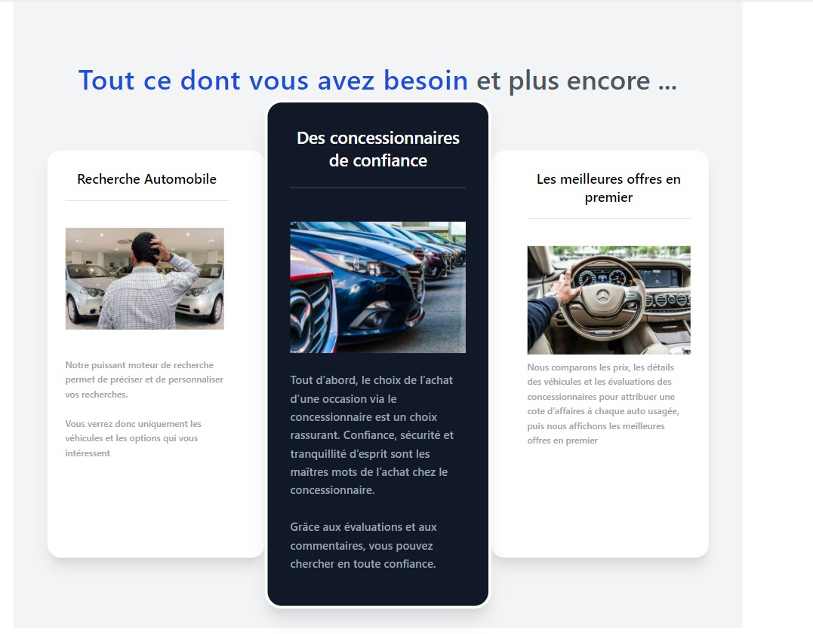
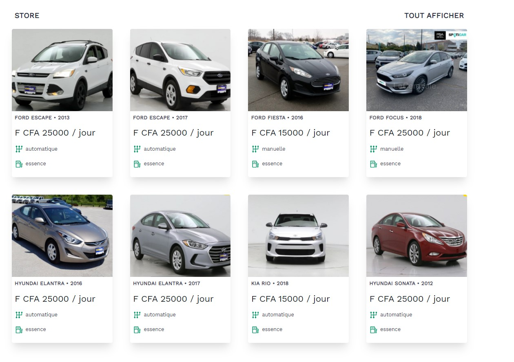
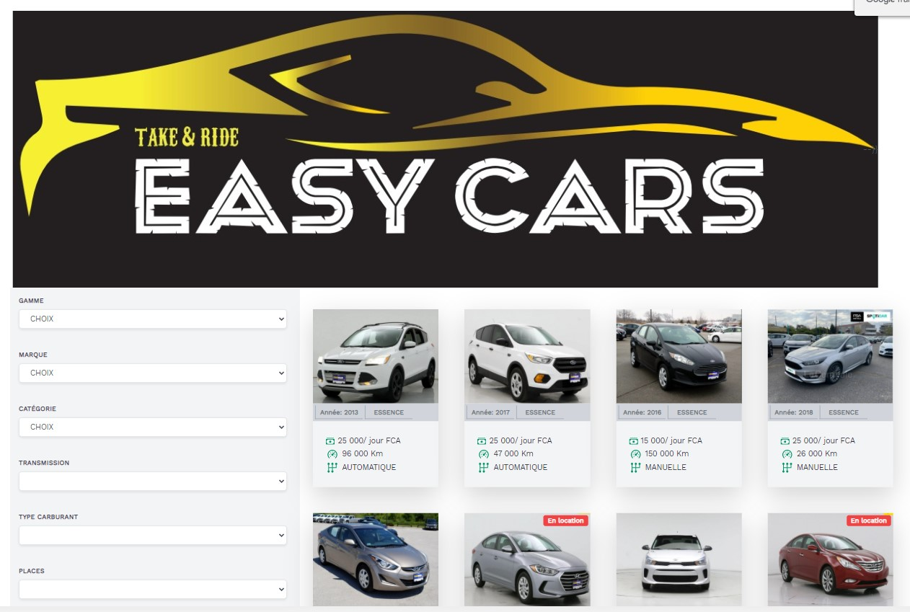
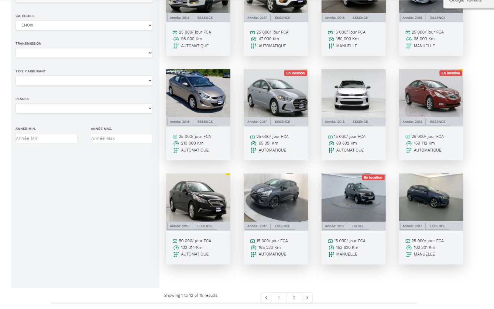
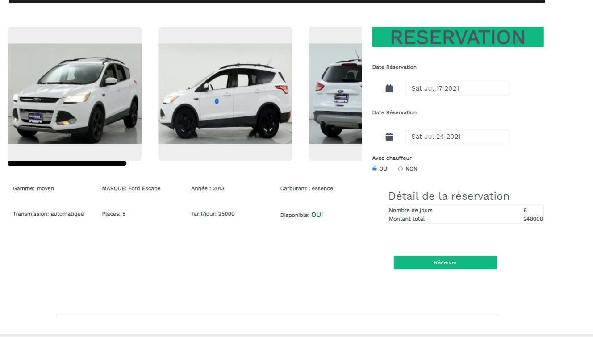
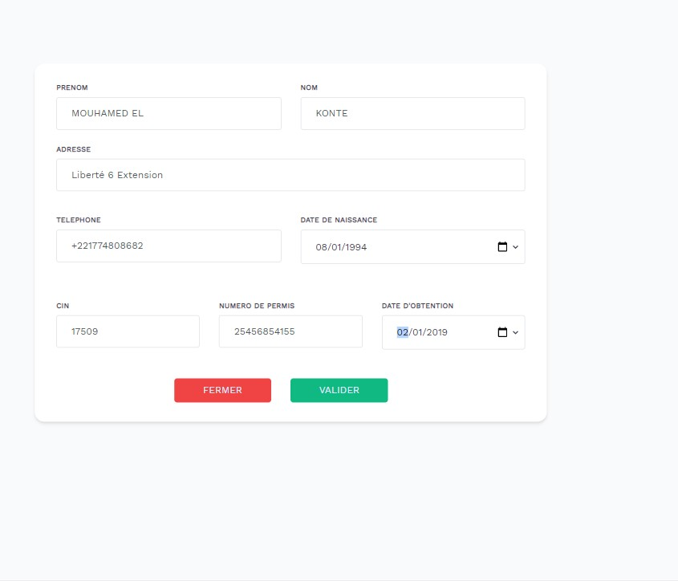

## About Easy Cars

C'est un site que j'ai crée pour un groupe d'étudiants dans le cadre de leur mémoire de fin d'étude pour l'obtention de leur licence.

C'est un site de location de voitures où le client peut consulter les offres et passer à la réservation.

Cette plateforme a été développé en une semaine pour permettre au groupe d'étudiant de pouvoir le présenter lors de leur soutenante.

Pour cela, j'ai utilisé:
* Laravel
* Livewire
* MySQL
* PHP 8

# Captures d'écran

## Accueil

## Store

## Réservation

